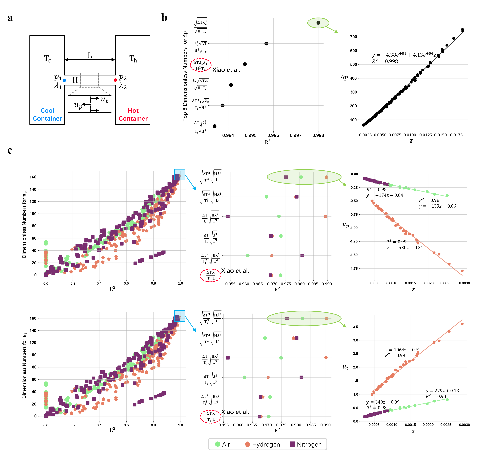

# FIND: A Framework for Discovering Formulas in Data

    

## Setup a Conda Environment

    conda create -n find python=3.9
    conda activate find
    conda install pytorch torchvision torchaudio pytorch-cuda=11.8 -c pytorch -c nvidia
    pip install -r requirements.txt

## Identify Network Structure

    python dataset/toy0.py
    python identify.py

**5D-Function Example.** The latent variables and expression of  the first function is 

$$\begin{aligned}
    & z_1= x_1^{-1.7} x_2^{-1.0},
    \quad z_2= x_3^{-1.2} x_4^{1.4},
    \quad z_3= x_5^{1.0} \\
    & y=3+0.4 z_1+1.3 z_2-0.7 z_3+0.6 z_1 z_2
    +1.2 z_3^2+ z_1 z_2 z_3.
\end{aligned}$$

**7D-Function Example.** The latent variables and expression of the second function is 

$$\begin{aligned}
& z_1= x_1^{-1.7} x_3^{0.2} x_7^{-1.0},
\quad z_2= x_2^{1.0} x_4^{-1.3},
\quad z_3= x_6^{-0.6} x_7^{0.7}, \\ 
& y=\text{sin}(2 z_1+\pi/3)- z_1 z_2+\text{e}^{ z_1 z_3}
+\text{sin}( z_3^2)+ z_1 z_2 z_3+ z_2^2.
\end{aligned}$$

By statistically analyzing the linear correlation and ratio of $\boldsymbol\rho$ values from multiple points, we can obtain the connection relationships and the weight ratios.

    

## Application #1: Finding Dimensionless Functions
    
    python dataset/toy.py
    python main.py -p opt/toy.yaml

    

## Application #2: Finding Dimensionless Numbers
**keyhole number** $Ke=\frac{\eta P}{\pi\rho_0 C_p\Delta T \sqrt{\alpha V_s r_0^3}}$

    python main.py -p opt/keyhole.yaml

**Reynolds number** $Re=\frac{\rho_0vl}{\mu}$

    python main.py -p opt/pde.yaml

## Application #3: Finding Physical Laws

    python main.py -p opt/solar1.yaml 

    

Due to the existence of many interrelated variables, there will be numerous high $R^2$ formulas, and we only select the one with the sparsest weights from the high $R^2$ formulas as the final solution.