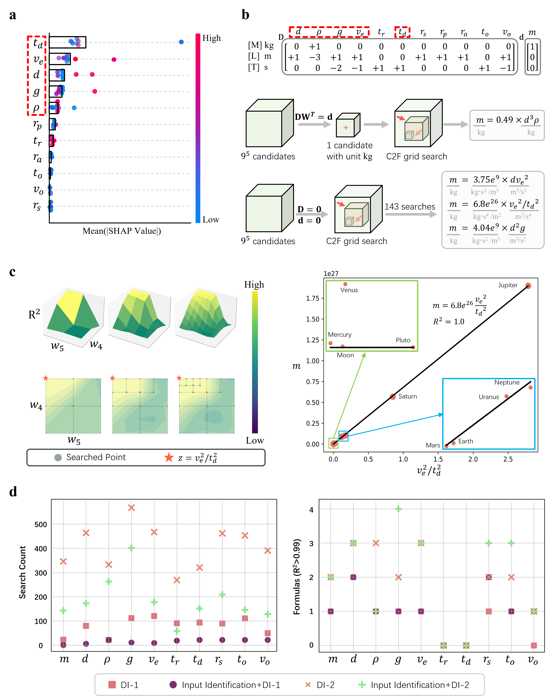

# Data-Driven Scientific Discovery with Buckingham $\Pi$ Theorem and Taylor's Theorem

<div>
    
</div>

## A High-Efficiency Interpretable Framework for Scientific Discovery

Our proposed method, FIND (Formulas IN Data), is a novel data-driven approach for discovering implicit mathematical formulas from diverse datasets.

**Explainable Structure.** Inspired by the Buckingham $\Pi$ theorem and Taylor's theorem, FIND introduces a two-level explainable structure:
- Based on the $\Pi$ theorem, a latent layer is designed to discover key latent variables and achieve data dimensionality reduction.
- Based on Taylor's theorem, an expression layer is designed to discover functional relationships between latent variables and outputs, using polynomials as temporary approximations of the original function.

**Structure Identification.** We conducted a prior analysis on the dataset to identify some structural information.
- Input Identification: We employ SHAP values to quantify input feature contributions, retaining only high-impact inputs to effectively reduce the search space.
- Latent Identification: We propose a latent structure identification method tailored for dense datasets, which can directly estimate relevant inputs, the number of latent variables, the connection relationships between inputs and latent variables, as well as weight ratios estimation based on the dataset.

**Parameter Constraint.** We constrain the search space using dimensional analysis, dataset patterns, and model architecture.
- Dimensional Invariance: We perform dimensional analysis on variables to constrain the parameter search space through unit consistency requirements, thereby deriving physically meaningful expressions.
- structural Constraints: We impose constraints on the model from data instance characteristics, weight equivalence, and parameter sparsity, which significantly reduces the search space.

**Parameter Optimization.** We propose two efficient optimization algorithms.
- Coarse to Fine (C2F) Search: We propose a C2F grid search strategy, which reduces the likelihood of converging to local optima by progressively refining the solution space. This approach efficiently locates the global optimum while ensuring interpretable and human-intuitive results.
- Multi-Level Optimization: We propose a multi-stage optimization algorithm for searching multi-latent-variable models. By fixing previously optimized latent variables and incrementally searching for new ones, this approach achieves significant reduction in search space while maintaining competitive performance metrics.

**Expression Simplification.** If the final derived expression is overly complex, symbolic regression is applied to simplify the polynomial into a more compact form. 

## Requirements
    conda create -n find python=3.9
    conda activate find
    conda install pytorch torchvision torchaudio pytorch-cuda=11.8 -c pytorch -c nvidia
    pip install -r requirements.txt

## Getting Started
All datasets used in this paper are available in [dataset/dataset.yaml](dataset/dataset.yaml), the experiment hyperparameters are specified in [opt/config.yaml](opt/config.yaml), and the results are provided at [https://cloud.tsinghua.edu.cn/d/510f1ee5329e4cb38a23/](https://cloud.tsinghua.edu.cn/d/510f1ee5329e4cb38a23/).

### 1. Physical Laws Discovery

    python identify_input.py 
    python main.py -p opt/solar.yaml

<div>
    
</div>

### 2. Dimensionless Numbers Dsicovery

    python main.py -p opt/compressor.yaml

<div>
    
</div>

### 3. PDE Discovery

    python dataset/pde_rlc.py
    python main.py -p opt/pde_rlc.yaml

<div>
    
</div>

### 4. Latent Structure Identification

    python dataset/rlc.py
    python identify_latent.py
    python main.py -p opt/rlc.yaml
    python main.py -p opt/rlc_sr.yaml

<div>
    
</div>

## Citations
```
@inproceedings{xiao2025find,
  title={FIND: A Framework for Discovering Formulas in Data},
  author={Xiao, Tingxiong and Cheng, Yuxiao and Suo, Jinli},
  booktitle={Proceedings of the AAAI Conference on Artificial Intelligence},
  volume={39},
  number={20},
  pages={21653--21660},
  year={2025}
}
```

## Contact
If you need any help or are looking for cooperation, feel free to contact us:
- Tingxiong Xiao
- Department of Automation, Tsinghua University, Beijing, China
- xtx22@mails.tsinghua.edu.cn