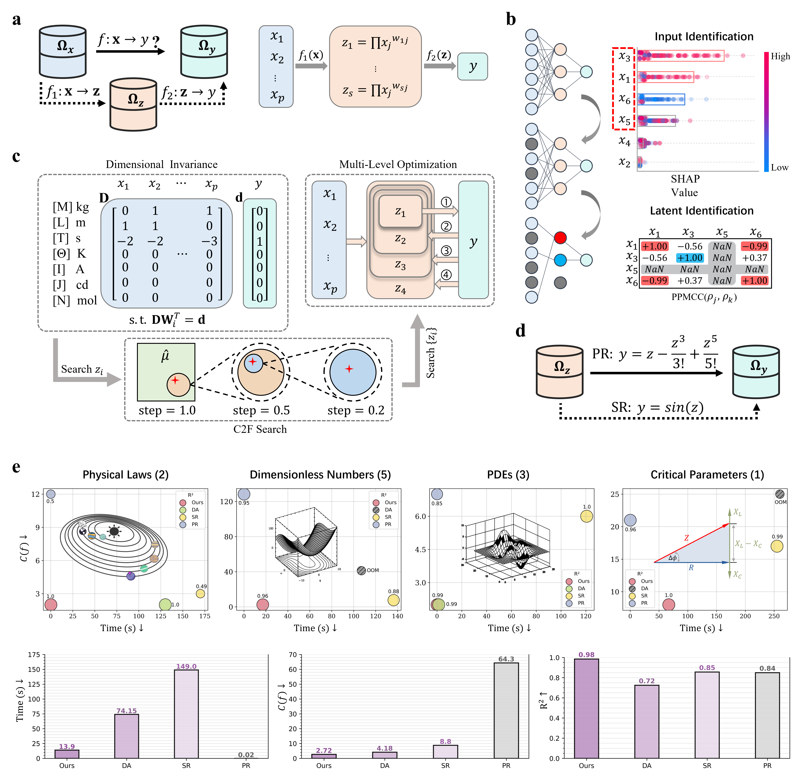
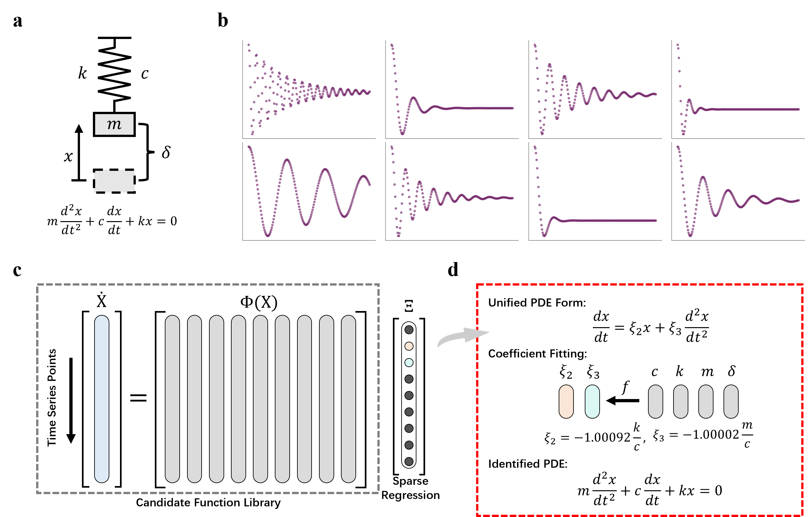

# Accelerating the Discovery of Governing Physical Laws with a Grounded AI Agent

<div>
    
</div>

## A High-Efficiency Interpretable Framework for Scientific Discovery

Our proposed method, FIND (Formulas IN Data), is a novel data-driven approach for discovering implicit mathematical formulas from diverse datasets.

**Agent-Assisted Scientific Discovery.** A conversational agent and a task-specific agent were developed to facilitate scientific discovery:
- conversational agent: This system supports conversational execution of tasks (e.g., dimensional matrix operations and formula checks) by combining LLM knowledge with web retrieval.
- task-specific agent: This system enables conversational interaction and task execution capabilities for hyperparameter tuning, data analysis, formula discovery/simplification/validation, and failure analysis.

**Explainable Structure.** Inspired by the Buckingham $\Pi$ theorem and Taylor's theorem, FIND introduces an ultra-shallow architectures:
- Based on the $\Pi$ theorem, a latent layer is designed to discover the latent variables and achieve dimensionality reduction.
- Based on Taylor's theorem, an expression layer is designed to discover the relationship between the latent variables and the output, using polynomials as temporary approximations of the target function.

**Structure Identification.** We conducted a prior analysis on the dataset to identify some structural information.
- Input Variable Identification: We employ SHAP values to quantify input feature contributions, retaining only high-impact inputs to effectively reduce the search space.
- Latent Variable Identification: We propose a latent structure identification method tailored for dense datasets, which can directly estimate relevant inputs, the number of latent variables, the connection relationships between inputs and latent variables, as well as weight ratios estimation based on the dataset.

**Parameter Constraints.** We constrain the search space using dimensional analysis, dataset patterns, and model architecture.
- Dimensional Invariance: We perform dimensional analysis on variables to constrain the parameter search space through unit consistency requirements, thereby deriving physically meaningful expressions.
- Structural Constraints: We impose constraints on the model from data instance characteristics, weight equivalence, and parameter sparsity, which significantly reduces the search space.

**Parameter Optimization.** We propose two efficient optimization algorithms.
- Coarse-to-Fine (C2F) Search: We propose a C2F grid search strategy, which reduces the likelihood of converging to local optima by progressively refining the solution space. This approach efficiently locates the global optimum while ensuring interpretable and human-intuitive results.
- Multi-Level Optimization: We propose a multi-level optimization algorithm for searching multi-latent-variable models. By fixing previously optimized latent variables and incrementally searching for new ones, this approach achieves significant reduction in search space while maintaining competitive performance metrics.

**Formula Simplification.** If the final derived expression is overly complex, symbolic regression is applied to simplify the polynomial into a more compact form. 

## Requirements
    conda create -n find python=3.9
    conda activate find
    pip install -r requirements.txt

Install [PyTorch](https://pytorch.org/get-started/locally/) according to your configuration.

## Getting Started
All datasets used in this paper are available in `dataset/dataset.yaml`, the experiment hyperparameters are specified in `opt/config.yaml`.

### 1. Astronomical Laws Discovery

    python identify_input.py 
    python main.py -p opt/solar.yaml

<div>
    
</div>

### 2. Dimensionless Numbers Dsicovery

    python main.py -p opt/compressor.yaml

<div>
    
</div>

### 3. PDEs Discovery

    python dataset/pde_spring.py
    python main.py -p opt/pde_spring.yaml

<div>
    
</div>

### 4. Structure Identification

    python dataset/rlc.py
    python identify_latent.py
    python main.py -p opt/rlc.yaml
    python main.py -p opt/rlc_sr.yaml

<div>
    
</div>

### 5. Agent-Assisted Scientific Discovery

<video width="600px" controls>
  <source src="docs/example.mp4" type="video/mp4">
</video>
#### a. Conversational Agent 

    python agent/agent_chat.py

It talks and informs, but can't act. See `agent/example_chat.txt` for some prompt examples.

#### b. Task-Specific Agent

    python agent/agent_task.py

This kind of agent can support your work in the following ways:

*   **Hyperparameter Analysis:** The agent will analyze function of each hyperparameter in the `opt/config.yaml` file.
*   **Hyperparameter Setting:** The agent can modify the hyperparameters of FIND according to the user's specific requirements.
*   **Structure Identification:** The agent can assist in performing data analysis with SHAP.
*   **Formula Discovery:** The agent can use FIND to discover potential mathematical formulas.
*   **Formula Simplification:** If the mined formula is overly complex, the user can request the agent to simplify it.
*   **Theoretical Verification:** We utilize the LLM's built-in domain knowledge and web search to verify the validity of the formulas.
*   **Failure Analysis:** If high-quality formulas cannot be found, the agent can analyze the reasons for the failure and adjust the strategy.
*   **Experimental Report:** The agent can summarize the entire experiment and modify and improve it according to user requirements.

<div>
    
</div>

## Citations
```
@inproceedings{xiao2025find,
  title={FIND: A Framework for Discovering Formulas in Data},
  author={Xiao, Tingxiong and Cheng, Yuxiao and Suo, Jinli},
  booktitle={Proceedings of the AAAI Conference on Artificial Intelligence},
  volume={39},
  number={20},
  pages={21653--21660},
  year={2025}
}
```

## Contact
If you need any help or are looking for cooperation, feel free to contact us:
- Tingxiong Xiao
- Department of Automation, Tsinghua University, Beijing, China
- xtx22@mails.tsinghua.edu.cn